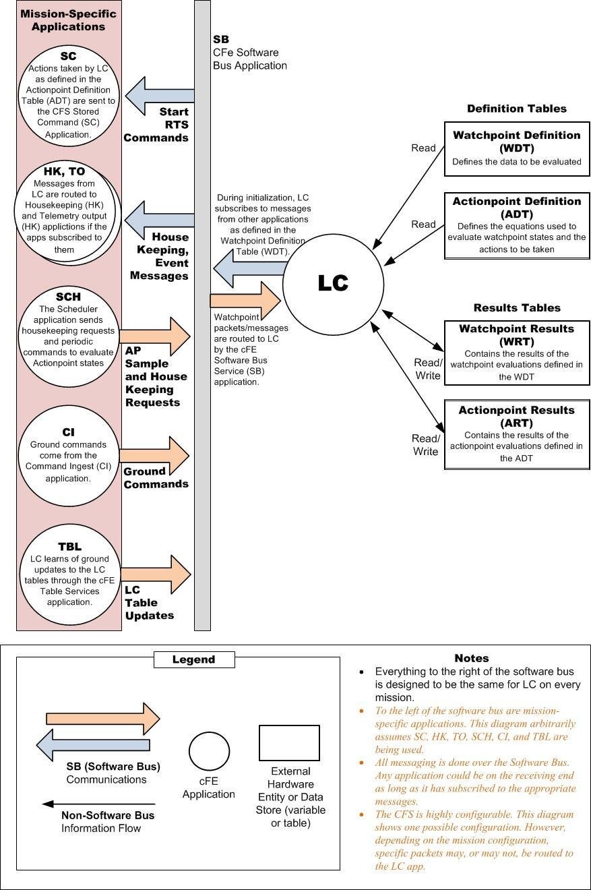

# cFS: Limit Checker

* [Original README](cfs-lc-app-OSS-readme.txt)

## Description

The Limit Checker application (LC) is a core Flight System (cFS) application
that is a plug in to the Core Flight Executive (cFE) component of the cFS.

The cFS is a platform and project independent reusable software framework and
set of reusable applications developed by NASA Goddard Space Flight Center. This
framework is used as the basis for the flight software for satellite data
systems and instruments, but can be used on other embedded systems. More
information on the cFS can be found at http://cfs.gsfc.nasa.gov

The LC application monitors telemetry data points in a cFS system and compares
the values against predefined threshold limits. When a threshold condition is
encountered, an event message is issued and a Relative Time Sequence (RTS)
command script may be initiated to respond/react to the threshold violation.

## Requirements

* [Operating System Abstraction Layer][osal] 4.1.1 or higher
* [core Flight Executive][cfe] 6.4.1 or higher

## Sources

* https://sourceforge.net/projects/cfs-lc/

[osal]: https://github.com/yusend/osal
[cfe]: https://github.com/yusend/coreflightexec
